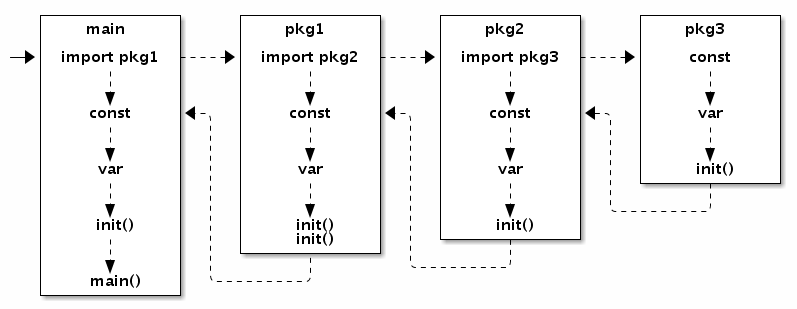

# 1.1 Go 文件结构

# 1.1.1 基本结构

每个 Go 文件都具有以下几个结构：

- 包声明
- 引入包
- 变量
- 函数
- 语句和表达式
- 注释

以上各个部分组合起来就是一下示例：

```go
// 包声明
package main

// 引入包声明
import "fmt"

// 函数声明
func printInConsole(s string) {
    fmt.Println(s)
}

// 全局变量声明
var str string = "Hello world!"


func main() {
    printInConsole(str)
}
```

# 1.1.2 初始化顺序

一个完整的 Go 语言可运行程序，大部分由 go 文件结构中包、变量以及 main 函数这几个部分组成。

包、变量、常量、init 函数和 main 函数的初始化顺序如下图所示：



程序会优先加载 main 包下的文件，然后根据引用包声明，逐个加载声明的引用包，而在加载这些包时，会再次加载包中声明的引用包，最终加载到最底层的包，并按照顺序初始化最底层包：常量 -> 变量 -> init 函数。

包加载完成后逐层返回，最终回到 main 包，然后加载 main 包下的常量、变量、init 函数，最后执行我们自己的代码 main 函数。

在初始化过程中，有一个比较特殊的函数，init 函数。

init 函数不能由用户自己调用也不能被引用，并且是在初始化引用包时，由 go runtime 自己调用。

并且当同一个包下在不同的源文件（即 Go 文件中）同时声明了多个 init 函数时，按照文件名以字典顺序大小，从小到大排序，小的先被执行。更准确的说法是，按照提交给编译器的源文件名顺序为准。

由于只会在初始化包时才会执行，且一般只会被执行一次，所以 init 函数一般用来初始化当前源文件中的一些变量。

## 1.1.2.1 初始化顺序示例

使用命令先初始化一个项目：

```go
mkdir init_order && cd init_order && go mod init github.com/learn/init_order
```

创建 pkg1、pkg2 目录：

```go
mkdir pkg1 && mkdir pkg2
```

使用 IDE 打开这个项目目录后，在 pkg1 目录下声明创建 pkg1.go 文件：

```go
package pkg1

import (
    "fmt"

    _ "github.com/learn/init_order/pkg2"
)

const PkgName string = "pkg1"

var PkgNameVar string = getPkgName()

func init() {
    fmt.Println("pkg1 init method invoked")
}

func getPkgName() string {
    fmt.Println("pkg1.PkgNameVar has been initialized")
    return PkgName
}
```

在 pkg2 目录下面创建 pkg2.go 文件：

```go
package pkg2

import "fmt"

const PkgName string = "pkg2"

var PkgNameVar string = getPkgName()

func init() {
    fmt.Println("pkg2 init method invoked")
}

func getPkgName() string {
    fmt.Println("pkg2.PkgNameVar has been initialized")
    return PkgName
}
```

在项目路径下声明 main.go 文件：

```go
package main

import (
    "fmt"

    _ "github.com/learn/init_order/pkg1"
)

const mainName string = "main"

var mainVar string = getMainVar()

func init() {
    fmt.Println("main init method invoked")
}

func main() {
    fmt.Println("main method invoked!")
}

func getMainVar() string {
    fmt.Println("main.getMainVar method invoked!")
    return mainName
}
```

执行 main 方法之后，可以得到一下输出：

```go
pkg2.PkgNameVar has been initialized
pkg2 init method invoked
pkg1.PkgNameVar has been initialized
pkg1 init method invoked
main.getMainVar method invoked!
main init method invoked
main method invoked!
```

可以